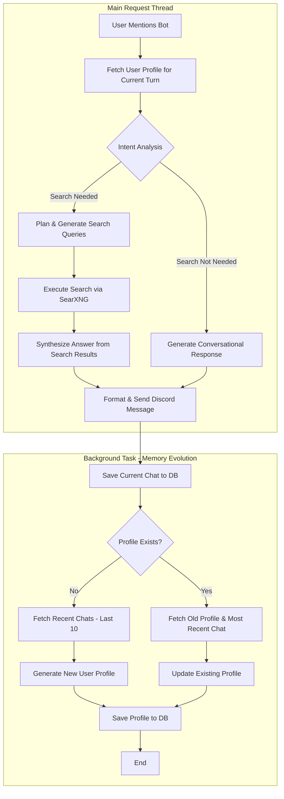

# Joney Bot

## About This Project

This project is my first dive into the world of AI, created as a fun way for me to learn and explore.

The idea was to build a simple, interactive AI chatbot for Discord. There are no complex commands to remember—just mention the bot's user (`@Bot Name`) with your question or prompt, and it will do its best to provide a helpful, interesting, or just plain fun response.

With the new addition of user based context, the command (`@Bot Name !context`) will simply return the context for the user

## How It Works

The bot follows a structured, multi-step process to decide when to search the web and how to synthesize information into a helpful answer. The core logic is visualized below:



## Prerequisites

Before running the application, you will need the following services available:

- **PostgreSQL w/ PGVector:** Used for persistent data storage, for now this is simply coversation history
- **SearXNG:** A running instance is required to act as the search engine tool for the bot.
- **Ollama:** Required to serve the local Large Language Model (LLM) that powers the bot's intelligence.

## Installation

You can run this bot either by building it directly from the source code with Python or by using the provided Docker Compose file for a containerized setup.

### Option 1: Build from Source

**1. Clone the Repo**

```bash
git clone https://github.com/jonahgcarpenter/joney-bot.git && cd joney-bot
```

**2. Create your .env**

```bash
cp .env.example .env
```

**3. Navigate to the App Directory**

```bash
cd app
```

**4. Create & Activate VENV**

```bash
python -m venv venv
```

```bash
source venv/bin/activate
```

**5. Install Dependancies**

```bash
pip install -r requirements.txt
```

**6. Run the Server**

```bash
python main.py
```

### Option 2: Docker Compose

**1. Create your .env**

```bash
cp .env.example .env
```

**2. Run the Server**

```bash
docker compose up -d
```

## Todo

- rate limiting per user
- add a like or dislike system, to make it easier to collect data for fine tuning
- combine intent analysis and search query models. when not worth searching simply return an empty array
- simplfy dockerfile with the removal of the local embedding model
- Get better output using trained models instead of system prompts
- Queue system for multiple request
