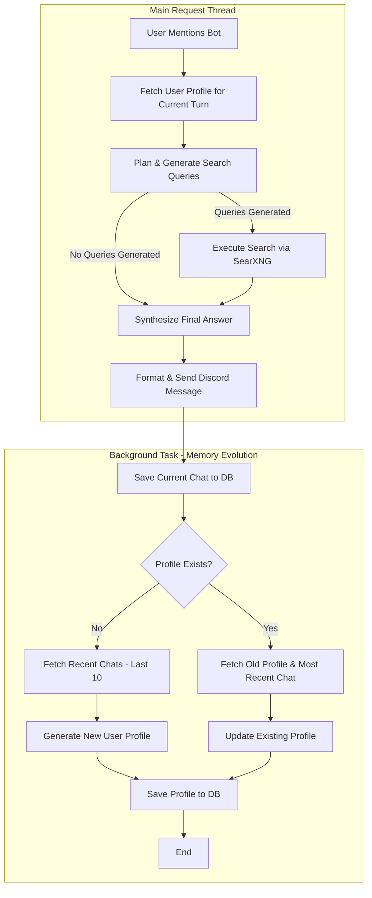

# Oswald-AI

## About This Project

This project is my first dive into the world of AI, created as a fun way for me to learn and explore.

The idea was to build a simple, interactive AI chatbot for Discord. There are no complex commands to remember—just mention the bot's user (`@Bot Name`) with your question or prompt, and it will do its best to provide a helpful, interesting, or just plain fun response.

With the new addition of user based context, the command (`@Bot Name !context`) will simply return the context for the user

## How It Works

The bot follows a structured, multi-step process to decide when to search the web and how to synthesize information into a helpful answer. The core logic is visualized below:



## Prerequisites

Before running the application, you will need the following services available:

- **PostgreSQL w/ PGVector:** Used for persistent data storage, for now this is simply coversation history
- **SearXNG:** A running instance is required to act as the search engine tool for the bot.
- **Ollama:** Required to serve the local Large Language Model (LLM) that powers the bot's intelligence.

## Installation

### Docker Compose:

```bash
services:
  oswald-ai:
    container_name: oswald-ai
    image: ghcr.io/jonahgcarpenter/oswald-ai/oswald-ai:latest
    environment:
      - DISCORD_TOKEN=${DISCORD_TOKEN}
      - OLLAMA_HOST_URL=${OLLAMA_HOST_URL}
      - SEARXNG_URL=${SEARXNG_URL}
      - DB_HOST=${DB_HOST}
      - DB_PORT=${DB_PORT}
      - DB_NAME=${DB_NAME}
      - DB_USER=${DB_USER}
      - DB_PASSWORD=${DB_PASSWORD}
      - DB_SCHEMA=${DB_SCHEMA}
      - LOG_LEVEL=${LOG_LEVEL}
      - CONTEXT_SUMMARY_COUNT=${CONTEXT_SUMMARY_COUNT}
```

### Env Example:

```bash
# Make a dedicated Discord App for this bot
# https://discord.com/developers/applications
DISCORD_TOKEN=your-discordbot-api-token

# Ollama
OLLAMA_HOST_URL=http://your-ollama-api-url:11434
OLLAMA_EMBEDDING_MODEL=nomic-embed-text:v1.5

# Searxng
# Web seach tool
SEARXNG_URL=http://your-searxng-url:8888

# Postgres DB
# To save each prompt and search query executed
DB_HOST=ip
DB_PORT=5432
DB_NAME=db_name
DB_USER=user
DB_PASSWORD=password
DB_SCHEMA=schema

LOG_LEVEL=DEBUG # Can be set to either INFO or DEBUG
CONTEXT_SUMMARY_COUNT=10 # Number of previous chats to be send as user_context
```

## Todo

- Oswald needs a complete architectural rework using tools like LangChain and LlamaIndex for better results
